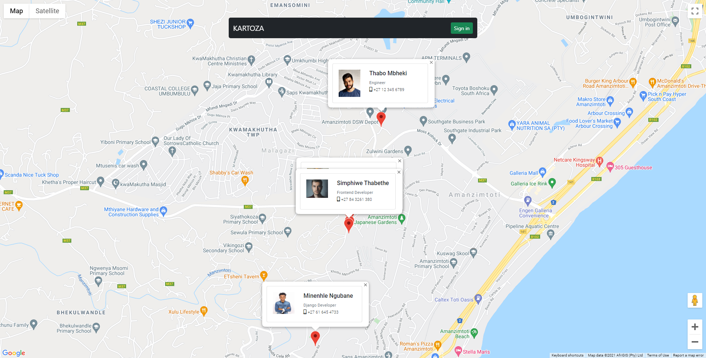
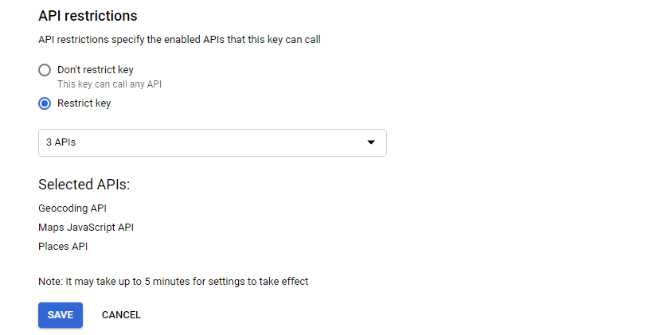

## Kartoza Technical Assignment


Django web application where a user can create an account and fill in their address details on their profile which the Google Geocoding API will convert into latitude and longitude. All the registered users will be shown by their location on a full page of google maps. 

When clicking the user icon, it will display the user’s profile in a popup. User can update their profile.

### Preview


### Setting up your Google API Key
1. Follow the instructions to [get a key](https://developers.google.com/maps/documentation/javascript/get-api-key "get a key")

2. Enable the following services under API Restrictions
    - [Places API](https://developers.google.com/maps/documentation/places/web-service/overview "Places API")
    - [Geocoding API](https://developers.google.com/maps/documentation/geocoding/overview "Geocoding API")
    - [Maps JavaScript API](https://developers.google.com/maps/documentation/javascript/overview "Maps JavaScript API")

    


### Local Development
To run this project in your development machine, follow these steps:

1. (optional) Create and activate a virtualenv (you may want to use virtualenvwrapper).

2. Fork this repo and clone your fork:

    `git clone https://github.com/Minenhle-Ngubane/kartoza-technical-assignment.git`

3. Install dependencies:

    `pip install -r requirements.txt`

4. Create a development database:

    `./manage.py migrate`

5. Configure your API_KEY in your settings.py file:

    ```python
    # Google API Key
    API_KEY = 'YOUR API KEY'
    ```

6. Configure your API_KEY in your base.html JS script tag file:
    ```html
    <!-- Async script executes immediately and must be after any DOM elements used in callback. -->
    <script src="https://maps.googleapis.com/maps/api/js?key=YOUR GOOGLE API KEY GOES HERE&libraries=places&callback=initMap"async></script>
    ```

7. If everything is alright, you should be able to start the Django development server:

    `./manage.py runserver`

8. Open your browser and go to http://127.0.0.1:8000

