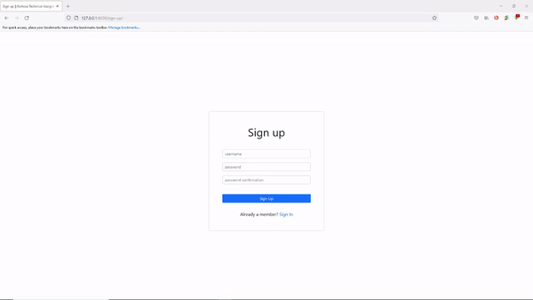

## Kartoza Technical Assignment

The following requirements should be met:

1. Create a portfolio python app using Django as a framework (https://www.djangoproject.com/),

2. The requirements are :
    - Extend the django user model to add further details for user profile, such as home address, phone number, location (point geometry) where they live 

    - A user profile page and a page to edit the user’s profile

    - A page with full screen map that shows all registered users location

    - When clicking the user icon (just use default icon), it will display the user’s
    profile in popup. 

    - Users can log in from the default Django admin page. User can only see
    their own profile page, but not others

    - User can only access Django admin page for all models by logging in as
    super user 

3. Bonus requirements :
    - Add test cases.

    - Enabled CI integration with your code repo such that any new code added via a PR will be  automatically tested and display an indicator as to whether the tests have passed or not.

    - Sign up and sign in page, you can use the existing library to do this (for non super users able to login).

    - Log the user login/logout activity by showing who and when on the admin page, you can use the existing library to do this.

### Gif Preview


### Setting up your Google API Key
1. Follow the instructions to [get a key](https://developers.google.com/maps/documentation/javascript/get-api-key "get a key")

2. Enable the following services under API Restrictions
    - [Places API](https://developers.google.com/maps/documentation/places/web-service/overview "Places API")
    - [Geocoding API](https://developers.google.com/maps/documentation/geocoding/overview "Geocoding API")
    - [Maps JavaScript API](https://developers.google.com/maps/documentation/javascript/overview "Maps JavaScript API")

### Local Development
To run this project in your development machine, follow these steps:

1. (optional) Create and activate a virtualenv (you may want to use virtualenvwrapper).

2. Fork this repo and clone your fork:

    `git clone https://github.com/Minenhle-Ngubane/kartoza-technical-assignment.git`

3. Install dependencies:

    `pip install -r requirements.txt`

4. Create a development database:

    `./manage.py migrate`

5. Configure your API_KEY in your settings.py file:

    ```python
    # Google API Key
    API_KEY = 'YOUR API KEY'
    ```

6. Configure your API_KEY in your base.html JS script tag file:
    ```html
    <!-- Async script executes immediately and must be after any DOM elements used in callback. -->
    <script src="https://maps.googleapis.com/maps/api/js?key=YOUR GOOGLE API KEY GOES HERE&libraries=places&callback=initMap"async></script>
    ```

7. If everything is alright, you should be able to start the Django development server:

    `./manage.py runserver`

8. Open your browser and go to http://127.0.0.1:8000

